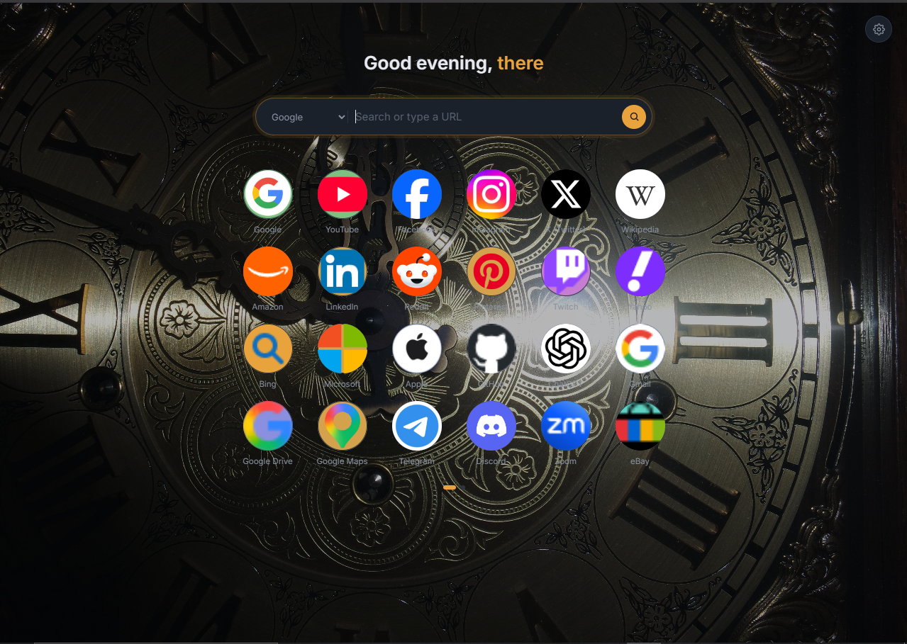
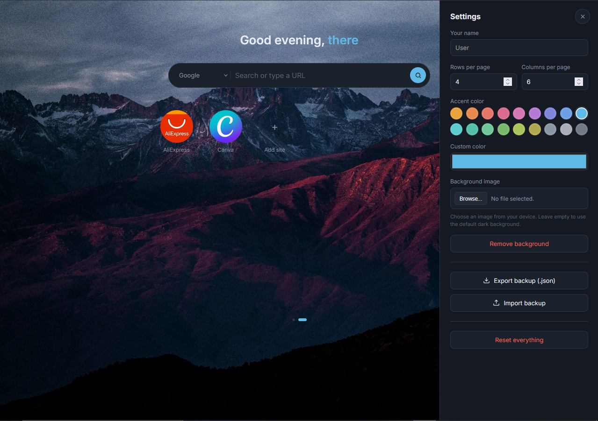
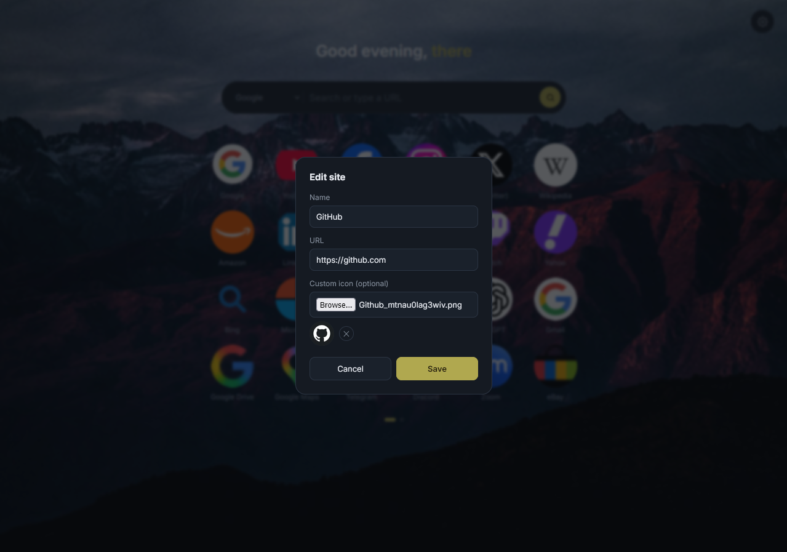

# ZS New Tab

A minimal, fast, and fully offline **New Tab** replacement for Chrome — a personal bookmark dashboard with a search bar, a customizable grid, and a settings panel. No accounts, no tracking, no backend. Everything is stored locally in your browser.


<p align="center">
  
  
  
</p>

## Features

- **Bookmark grid** — add, edit, delete, and reorder sites with drag & drop
- **Custom icons** — auto-fetched favicons, with the option to upload your own icon per site, and a colored-letter fallback if a favicon fails to load
- **Quick search** — search from the new tab directly, with a switchable search engine (Google, DuckDuckGo, Brave, Bing), or type a URL to go straight there
- **Pagination** — grid pages with dot navigation, arrow buttons, and mouse-wheel scrolling
- **Settings panel** — customize your display name, grid rows/columns, and background image
- **Custom background** — upload any image as your background
- **Smart image compression** — background and icon uploads are automatically downscaled (via canvas, before saving) to keep storage lean and loading fast, without a visible quality hit
- **Backup & restore** — export your full setup (sites, settings, background image) to a `.json` file, and import it back anytime
- **Keyboard shortcuts** — `/` to focus search, `Esc` to close any open panel or modal
- **Dark UI** — clean dark theme with smooth transitions, built with plain CSS (no frameworks)
- **Two performance modes** — a default build and a "shadow" build; see [Default vs Shadow](#default-vs-shadow-performance-mode) below

## Default vs Shadow (performance mode)

The project ships with two versions of the app logic and styling, side by side. Both give you the exact same features — the only difference is *where data is stored* and *how the first load looks*.

| | `script.js` + `styles.css` (default) | `script.shadow.js` + `styles.shadow.css` (shadow) |
|---|---|---|
| Sites & settings | `localStorage` | `localStorage` |
| Background image & custom icons | `IndexedDB` | `localStorage` (same store as everything else) |
| First-load animation | Yes — background and grid fade in together | None — everything renders instantly |
| Load speed | Fast | As fast as the browser can render — practically instant |
| Storage ceiling | Effectively unlimited (IndexedDB has no ~5MB wall) | Bound by the browser's localStorage limit (~5MB), so realistically **up to about 100 sites, each with a custom uploaded icon**, plus a background image |

**Use the default (`script.js` / `styles.css`)** if you want no practical limit on how many sites or custom icons you keep, and don't mind a small fade-in on first load.

**Use the shadow build (`script.shadow.js` / `styles.shadow.css`)** if you want the absolute fastest possible open — the grid, icons, and background all appear in a single blink, with zero transition — and your setup comfortably fits under the localStorage ceiling (a browsing habit around ~100 custom-icon sites or fewer is the safe zone).

### How to switch

Open `index.html` and update the two import tags:

```html
<!-- Default -->
<link rel="stylesheet" href="styles.css">
...
<script src="script.js"></script>
```

```html
<!-- Shadow (max speed, no first-load animation) -->
<link rel="stylesheet" href="styles.shadow.css">
...
<script src="script.shadow.js"></script>
```

Both files (script + styles) must be swapped together — never mix a default one with a shadow one.

When switching between modes, do it in this order to avoid conflicts: Export backup → Reset → Switch the files → Import backup. You can switch back to the default files at any time the same way.

## Supported browsers

Built on Manifest V3 (minimum Chrome 88), so it works on any Chromium-based browser:
- Chrome
- Edge
- Brave
- Opera
- Vivaldi

## Installation

### From source (developer mode)

1. Clone or download this repository.
2. Open Chrome and go to `chrome://extensions`.
3. Enable **Developer mode** (top-right toggle).
4. Click **Load unpacked** and select the project folder.
5. Open a new tab — you're done.

### Enable in Incognito (optional)

Go to `chrome://extensions`, find **ZS New Tab**, click **Details**, and toggle **Allow in incognito**.

## Opera Support

Opera's extension store enforces stricter validation on `chrome_url_overrides.newtab` for
side-loaded / unpacked extensions, and rejects it with:

> `'chrome_url_overrides' is not allowed for specified extension ID.`

To use **ZS New Tab** on Opera, replace `manifest.json` with the following, and add a
`background.js` file next to it. Instead of overriding the new tab page directly, this
approach uses a background script that listens for Opera's default start page / new tab
URLs and redirects them to `index.html`.

**`manifest.json` (Opera variant):**
```json
{
  "manifest_version": 2,
  "name": "ZS New Tab",
  "short_name": "New Tab",
  "version": "1.0.0",
  "description": "A custom new tab page with a bookmark grid, quick search, and a settings panel for background image, layout, and backups.",
  "author": "Ziad Shalaby",
  "minimum_chrome_version": "88",
  "permissions": [ "tabs" ],
  "background": {
    "scripts": ["background.js"]
  },
  "icons": {
    "16": "./icons/favicon-16x16.png",
    "48": "./icons/favicon-32x32.png",
    "128": "./icons/android-chrome-192x192.png"
  },
  "incognito": "split"
}
```

**`background.js`:**
```javascript
function redirectToIndex(tabId) {
  chrome.tabs.update(tabId, {
    url: chrome.runtime.getURL("index.html")
  });
}

chrome.tabs.onUpdated.addListener((tabId, changeInfo, tab) => {
  const currentUrl = changeInfo.url || tab.pendingUrl || tab.url || "";

  if (currentUrl) {
    const startPages = [
      "opera://startpage",
      "chrome://startpage",
      "chrome://newtab",
      "edge://newtab",
      "about:blank"
    ];

    if (startPages.some(page => currentUrl.startsWith(page))) {
      redirectToIndex(tabId);
    }
  }
});
```

## Project structure

```
├── manifest.json             # Chrome extension manifest (MV3)
├── index.html                # New tab page markup (points to either the default or shadow files)
├── styles.css                # Default styling — dark theme, responsive grid, panels, modal, first-load transition
├── styles.shadow.css         # Same styling as styles.css, minus the first-load transition
├── script.js                 # Default app logic — state, rendering, IndexedDB (background/icons), drag & drop, import/export
├── script.shadow.js          # Same app logic as script.js, but background image and custom icons are stored in localStorage instead of IndexedDB
├── CONTRIBUTING.md           # How to set up the project and submit changes
├── ISSUES.md                 # Known issues and how to report bugs
├── icons/
└── images/
```

## Tech stack

- Vanilla HTML, CSS, and JavaScript — no build step, no dependencies
- `localStorage` for app state (sites and settings) in both builds
- Default build (`script.js`): `IndexedDB` for background images and custom site icons
- Shadow build (`script.shadow.js`): `localStorage` for background images and custom site icons too, for instant reads with no async database calls
- Canvas-based image resizing pipeline for compressing uploads before storage
- Google Fonts (Inter, JetBrains Mono) loaded via CDN

## Performance & UX details

- **Default build**: on startup, the app waits for both the grid render and the background image to be ready before revealing anything, so the page appears as a single smooth transition instead of the background and bookmarks popping in at different times. A short timeout safeguard ensures a slow background load never blocks the page from appearing.
- **Shadow build**: there's nothing to wait for — the background and every icon are already sitting in `localStorage` as part of the same state object, so they render synchronously with the rest of the page. No transition, no timeout safeguard needed; the trade-off is the shared ~5MB `localStorage` ceiling across sites, icons, and background combined.
- **Automatic image resizing** (both builds): any image you upload (background or site icon) is resized on a `<canvas>` before being saved — backgrounds are capped at 1920×1080 and icons at 128×128 — cutting down storage size and speeding up future loads, with no manual compression needed from the user.

## Customization

- **Search engines**: add more options in the `<select id="engineSelect">` element in `index.html`.
- **Colors**: all theme colors are CSS variables at the top of `styles.css` / `styles.shadow.css` (`:root { --accent, --bg-0, ... }`) — change them in one place to re-theme the whole app. Keep both files in sync if you use the shadow build as a fallback.
- **Default bookmarks**: edit the `defaultState.sites` array in `script.js` (or `script.shadow.js`, if that's the one you're running) to change what ships by default for a fresh install.
- **Resize limits**: adjust the max width/height/quality passed to `resizeImage()` in whichever script file you're using if you want larger or smaller stored images.

## Data & privacy

Almost everything lives in your browser only:
- Sites and settings → `localStorage` (both builds)
- Background image and custom site icons →
  - Default build: `IndexedDB` (resized before storage to keep things light)
  - Shadow build: `localStorage`, alongside everything else (same resizing applies)

Two things do reach outside your browser:
- **Favicon lookups**, via Google's public favicon service (`https://www.google.com/s2/favicons`), used to fetch each site's icon.
- **Google Fonts**, loaded from `fonts.googleapis.com` and `fonts.gstatic.com` for the Inter and JetBrains Mono typefaces used in the UI.

No account, analytics, or backend is involved beyond that.

## Backup

Use **Export backup (.json)** in the settings panel to save your full setup, and **Import backup** to restore it — on this browser or a fresh install. This works the same way regardless of which build (default or shadow) you're running, and a backup exported from one build can be imported into the other. Only backup files exported by this extension are supported; a manually edited or malformed JSON file will show an "invalid backup" alert.

## Contributing

Contributions are welcome — see [CONTRIBUTING.md](./CONTRIBUTING.md) for setup instructions and the PR workflow. Found a bug or have a feature request? Check [ISSUES.md](./ISSUES.md) for the bug report format and a list of known issues before opening a new one.

## License

Developed entirely by [Ziad Shalaby](https://github.com/ziadshalaby00).

MIT — do whatever you'd like with it.